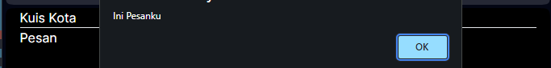

|  | Pemrograman Berbasis Framework 2024 |
|--|--|
| NIM |  2341728026|
| Nama |  Anwar Alif Katresna |
| Kelas | TI - 3A |

## Pratikum 1  

## Pratikum 2

Tampilan berubah dan isi dari pesan alert berubah sesuai yang ditentukan di parameter.   

## Pratikum 3
Ketika Tombol-1 ditekan  sekali alert akan menampilkan pesan "Child Element : Tombol-1" dan pesan "Parent Element : Div".  

Dan ketika di klik di Tombol-2 alert akan menampilkan pesan "Child Element : Tombol-2" dan pesan "Parent Element : Div".  

   

Dan ketika kita menambahkan event stop propagation, alert hanya akan menampilkan pesan child element/komponen.   

## Pratikum 4  

Ketika tombol "artikel selanjutnya" ditekan maka halaman page akan berubah ke artikel berikutnya sesuai dengan urutan index di articel.tsx.  

   
   

## Soal  
1. Jika kita menekan tombol "Artikel Selanjutnya" sebanyak 5x (atau melebihi halaman total artikel), apa yang akan terjadi?  
Jawab: Makan halaman page akan menampilkan error
   
2. Modifikasilah gallery.tsx agar bisa meng-handle permasalahan tersebut.  
Jawab: Dengan menambahkan function totalPage dan statemen 'if' pada fuction handelClick dimana button hanya aktif jika index page kurang dari index -1 dari total index.  

3. Tambahkan tombol "Artikel Sebelumnya", untuk menampilkan artikel secara mundur.   
Jawab: 
    

## Pratikum 5   

Ketika dijalankan pada browses muncul form seperti gambar berikut:  
  
Ketika Jawaban Salah:    
  
Ketika Jawaban Benar:   
  

>Langkah 2 ketika dijalankan:
  
## Soal  
1. Apa perbedaan dari fungsi Form_2 yang pertama dengan yang kedua?  
Jawab: Output yang dihasilkan sama, perbedaan terdapat pada statement dan variable yang ada. Pada Form_2 pertama menggunakan state fullName, sedangkan pada Form_2 kedua menggunakan Variable

2. Kenapa perlu menghapus state fullName? Apa keuntungannya?  
Jawab: Karena state fullName hanya merupakan gabungan string dari state firstName dan lastName. Hal ini membuat state redundan, dan bisa membuat kesalahan/bug pada aplikasi react/nextjs. Untuk itu, state fullName bisa dihapus dan digantikan variable biasa.

